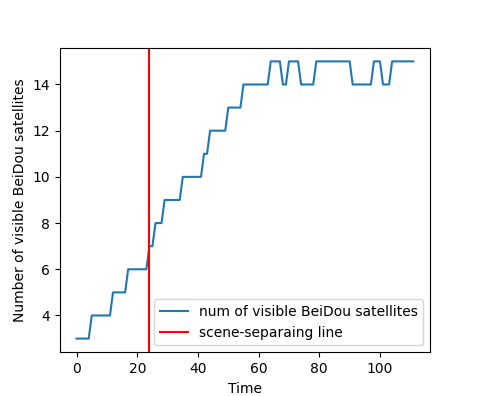
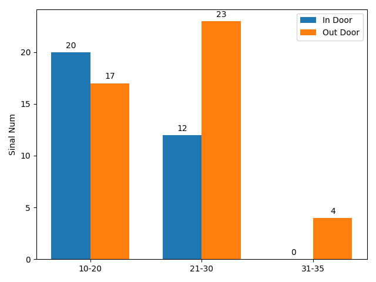
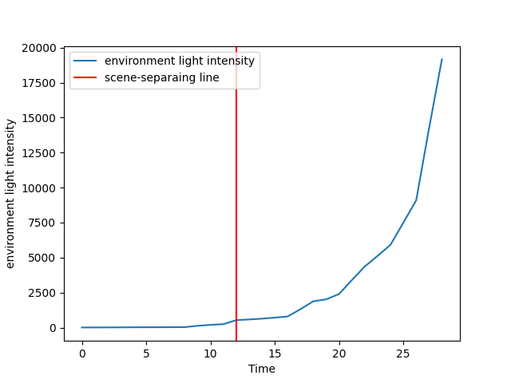
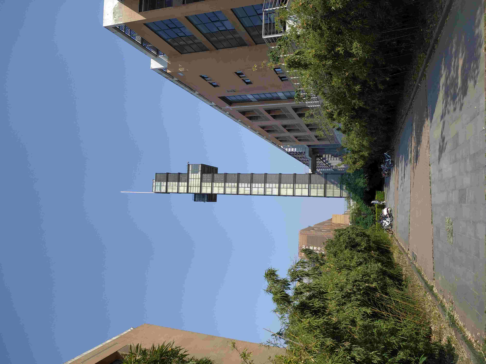
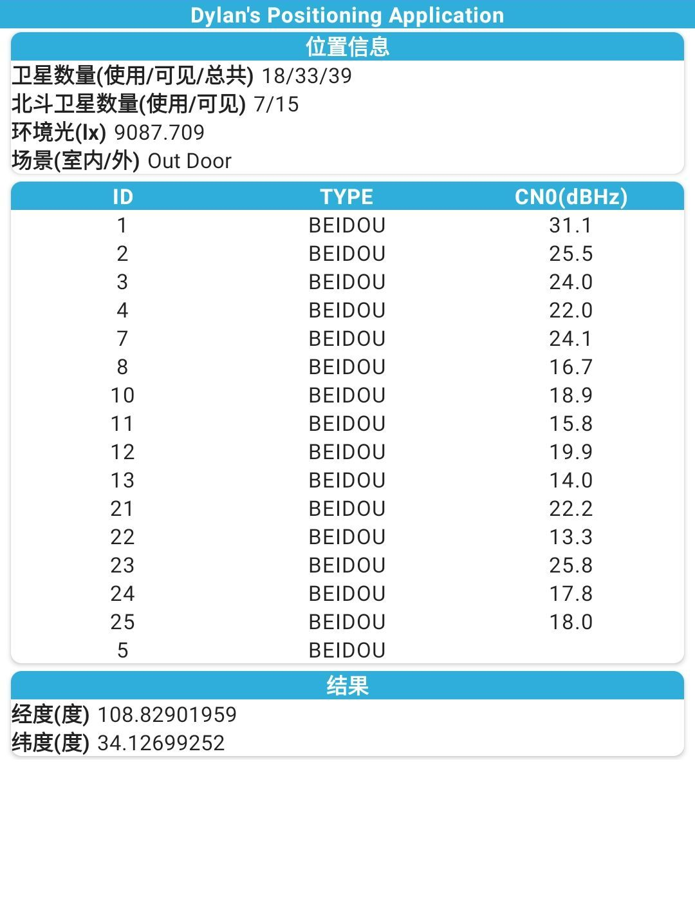
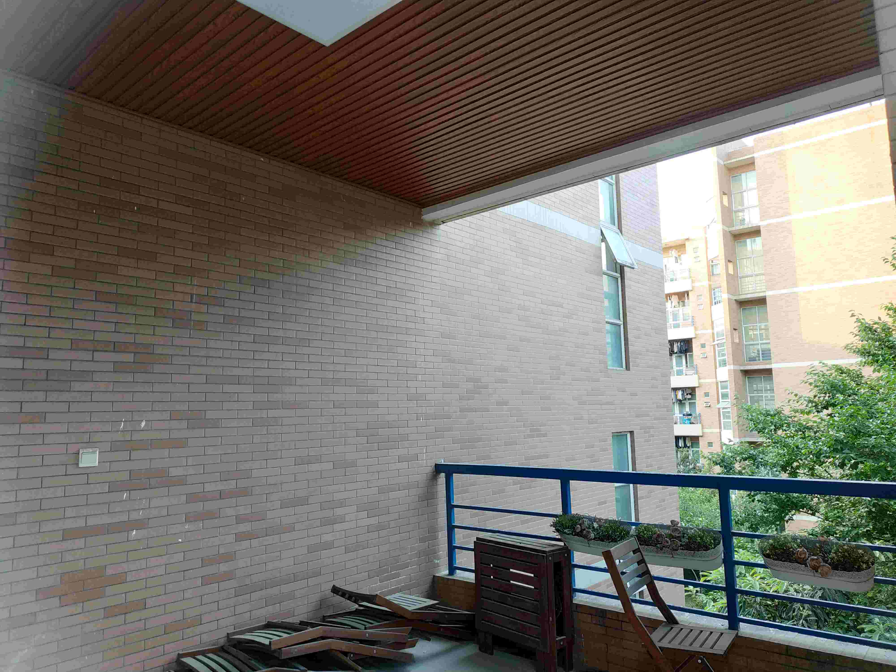
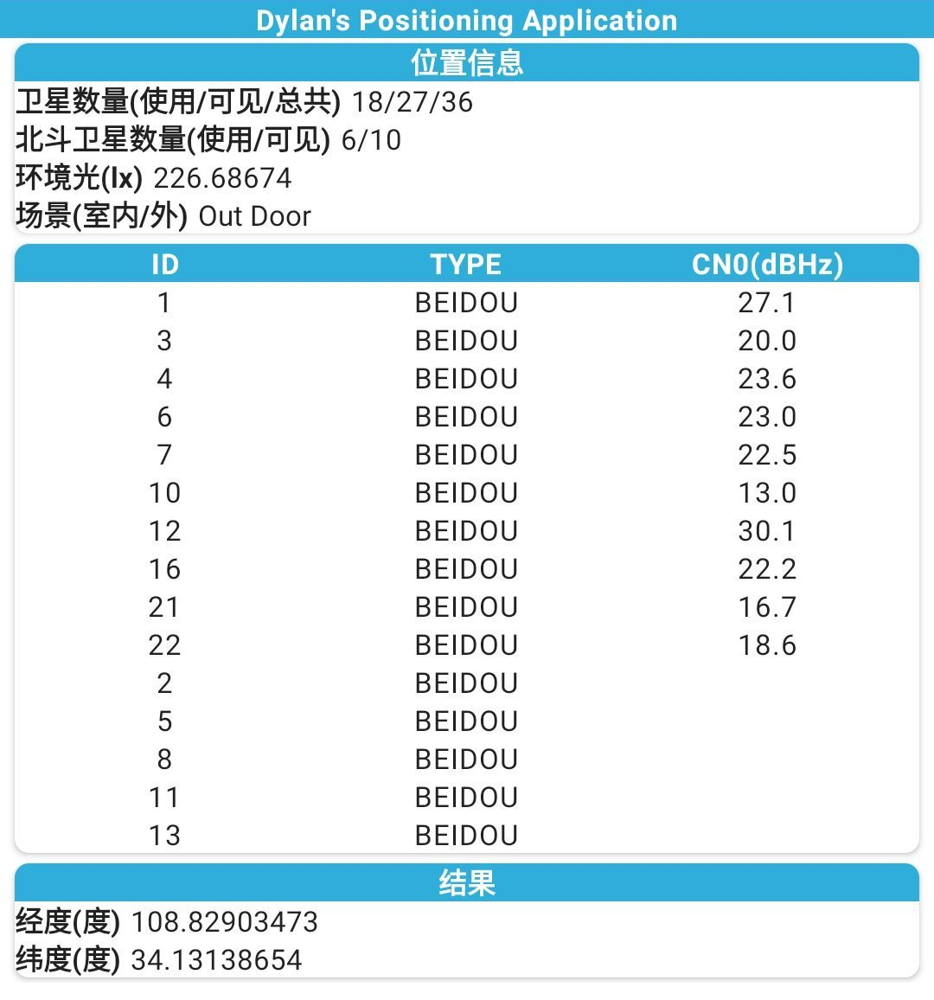

一种基于北斗与 5G 的室内外融合定位技术
######################################

:date: 2022-05-09 05:28

.. contents::

0. abstract
===========

室外开放环境下，以我国自主研发的北斗导航卫星定位系统和美国全球定位
系统（Global Positioning System，GPS）为代表的全球导航卫星系统（Global
Navigation Satellite System，GNSS）系统已经实现了较为精确的定位。但由于卫星
信号会受到多径效应等因素干扰，室内场景的定位仍存在精度较低等问题。目前大
量建设的 5G 微基站发射的 5G 信号具有高带宽、高纵深和高速率等特点，而且其
信号中还包括专门用于定位的位置参考信号(Positioning Reference Signal，PRS)，
终端接收到 5G 基站的定位测量信息更加充足，使得北斗与 5G 的融合定位成为了
可能。

考虑到室内外不同的定位场景，本文提出了一种基于北斗与 5G 的室内外融合
定位模型，并且在 Android 系统上部署为移动端应用。首先，根据室内和室外两种
场景下具有可判别性的数据，即环境光强度、可见北斗卫星数量以及北斗卫星信号
的载噪比这三种数据为特征数据，设计了一个基于神经网络的场景判别模型，判断
出终端设备所处的场景为室内还是室外。然后针对室内和室外这两种场景的特点
应用不同的定位算法，当终端设备处于室外环境(或轻微遮挡的半开放室内环境)
时，可见的北斗卫星提供的测量信号充足，足以实现精准的定位;而室内环境(或
遮挡严重的室外环境)下，可见的北斗卫星提供的测量数据无法用于较为准确的定
位，甚至无法用于定位，此时引入终端设备接受到 5G 微基站的测量数据，与北斗
卫星提供的测量数据融合，实现较为准确的用户定位。最后，本应用在 Android
Studio 上进行开发与调试，并于搭载 Android 系统的终端设备上进行部署与测试。
测试结果表明本文提出的北斗与 5G 融合定位算法具备较好的定位精度。

本文首先提出了一种基于神经网络的室内外场景判别模型，又利用 5G 微基站
提供的测量信息改善了室内情况下北斗卫星提供测量信息不足的情况，随后自动
判别场景并调用不同的定位算法，以软硬件结合的方式实现了一种基于北斗与 5G
的室内外融合定位技术。

1. Introduction
===============

1.1. 研究背景及意义
-------------------

卫星信号易受干扰，当终端设备处于城市峡谷、室内以及室外受遮挡的场景时，信号非视距
传播（None Line of Sight, NLOS）的影响使得终端设备的定位仍存在精确度不高等问题。
目前大量建设的5G微基站发射的5G信号不仅具有高带宽、高纵深和高速率等特点，而且还包
括专门为定位功能设计的下行定位参考信号（Downlink Positioning Reference Signal，
DPRS）。2017年，Google 开放了 Android 系统中 GNSS 相关的 API，自此可直接从
Android 手机中获取卫星传输信号的原始观测数据。

1.2. 研究现状
-------------

1.2.1. 室内定位技术
~~~~~~~~~~~~~~~~~~~

美国的联邦通信委员会（Federal Communications Commission，FCC）于 1966 年制定的
Enhanced 911 定位标准推动了室内定位技术的快速发展，该技术发展至今已经形成了基于
超宽带、蓝牙、WLAN、接收信号强度指标（Received Signal Strength Indicator，RSSI）
等多种方式的室内定位技术。

  (1). UWB 定位技术

  原理类似卫星定位，提前将定位设施部署于室内，可以获得终端接收机上面定位标签与
  这些已知定位基站之间的距离，根据这些信息定位。UWB 穿透力强、耗电低，不易受室内
  多径效应的影响，发展前景很好。

  (2). 蓝牙定位技术

  指纹匹配方法，根据其相对于预先部署于室内的蓝牙接入点的信号强度值进行室内定位。
  受众广阔，但蓝牙协议延迟高，通信距离短，匹配精度不高。

  (3). WLAN 定位技术

  也是指纹匹配，但是传播距离较长，覆盖范围更广。但是受接入点影响较大，而且热点
  密集的场所信号互相干扰影响精度。

这些技术不够成熟，存在这些问题：

  (1). 需要额外硬件成本。提前部署定位设备。

  (2). 庞大数据库支持。需要及时更新数据库，不能适应泛化陌生环境。

  (3). 终端处于室内外过渡场景时，定位盲区依然存在。

1.2.2. 室内定位算法
~~~~~~~~~~~~~~~~~~~

(1). 传输时间（TOA）和传输时间差（TDOA）基于距离的计算方法。TOA 要求基站时钟和
终端时钟保持同步，较小的时钟误差会产生较大的距离误差。因此改进的 TDOA 算法应运
而生，将时钟同步要求降低为仅需要所有基站同步。

(2). 到达角度（AOA）定位算法。硬件成本较高，终端设备需要配备方向感知较强的天线
阵列。

(3). 基于接受信号强度（RSSI）的定位算法。将室内区域划分为小网格，采集每个网格
单元处接受到的 RSSI 并建立对应了网格定位信息的数据库。终端定位时获取所处 RSSI 的
相应位置。

(4). 辅助全球卫星导航系统（A-GNSS），综合 GNSS 定位信息和网络基站信息，硬件成本、
技术要求以及定位精度都很高。北斗系统也支持 A-BDS，通过无线网络提供的辅助信息加速
终端机冷启动时间。

1.2.3. 场景判别技术
~~~~~~~~~~~~~~~~~~~

室内外场景判别领域可粗略划分为两种形式，第一种是采用特有的识别硬件，第二种则是
使用判别性足够强的特征数据。

此处省略一些国内外的研究现状。

本文提出一种以可见北斗卫星数量、卫星信号载噪比以及环境光强度这三者为特征数据、以
神经网络为基本结构的室内外场景判别模型。

1.2.4. 室内外融合定位技术
~~~~~~~~~~~~~~~~~~~~~~~~~

此处省略一些国内外的研究现状。

1.3. 主要研究内容与论文结构
---------------------------

略

2. 室内外融合定位相关技术
=========================

2.1. 室内外场景判别技术
-----------------------

2.1.1. 神经网络
~~~~~~~~~~~~~~~

这部分只有激励函数值得一提，是因为其引入了非线性因素，使其可逼近任何非线性函数。
例如常见的 :math:`Sigmoid` 函数：

.. math::

   Sigmoid(x) = \frac{1}{1+e^{-x}}

此函数将输入值映射为 :math:`(0, 1)` 的数值，将线性运算的结果映射到范围内，使其变为
二分类问题，这恰好对应了本文的室内外场景判别问题。

2.1.2. 室内外场景的特征数据
~~~~~~~~~~~~~~~~~~~~~~~~~~~

(1). 可见北斗卫星数量

(2). 卫星信号载噪比

(3). 环境光强度

2.1.3. 使用神经网络判别室内外场景
~~~~~~~~~~~~~~~~~~~~~~~~~~~~~~~~~

前文所述有三个特征数据，所以输入层采取三个神经元，分别对应这三种特征。又因为
室内外场景判别是一个二分类问题，因为输出层为两个神经元，分别对应这两种场景。
隐藏层神经元个数往往没有定数，一般可尝试多次调整。此处隐藏层选用四个神经元。
激活函数选用可将输入映射到 :math:`(0, 1)` 区间的 :math:`Sigmoid` 函数。

2.2. 北斗定位技术
-----------------

2.2.1. 北斗卫星导航系统简介
~~~~~~~~~~~~~~~~~~~~~~~~~~~

在我国及周边区域，北斗系统的位置精度因子（Position Dilution of Precision, PDOP）
优于 5.0，一些重点区域的 PDOP 在 2.0 左右。

2.2.2. 北斗卫星单点定位
~~~~~~~~~~~~~~~~~~~~~~~

待解算终端设备的空间位置为 :math:`(x, y, z)` ，4颗已知卫星的空间位置为 :math:`(x_{sat}, y_{sat}, z_{sat})`

2.3. 经典定位技术
-----------------

根据测量物理量的不同，可分为测距与非测距。

2.3.1. 到达时间定位算法
~~~~~~~~~~~~~~~~~~~~~~~

TOA 稳定可靠，但 1） 要求所有基站和终端机时钟同步，较小钟差也会导致较大误差。2）基站
传输信号必须有时间戳，以便终端机得到信号发送时间，这提高了信号的复杂度，可能出现
额外错误信息。3）需要已知基站的位置。

2.3.2. 到达时间差定位算法
~~~~~~~~~~~~~~~~~~~~~~~~~

TDOA 消解了基站时钟与终端机同步这一需求，解决了 TOA 的第一条不足。优于 TDOA 测量
值是各个节点的时间差，因此来自基站的传输信号无需包含时间戳，降低了信号复杂度与
潜在出错的可能性。

2.4. 最小二乘求解TOA与TDOA定位算法
----------------------------------

微基站为终端机提供了充足的测量信息，所以大多数情况下观测值数量大于参数个数。而
最小二乘法恰好可用来解决多组样本观测值冗余的情况。最小二乘法可分为线性最小二乘和
非线性最小二乘。其中线性最小二乘可直接得到解析解，非线性最小二乘不断迭代获取优解。

2.4.1. 线性最小二乘求解TOA与TDOA定位算法
~~~~~~~~~~~~~~~~~~~~~~~~~~~~~~~~~~~~~~~~

2.4.2. 非线性最小二乘求解TOA与TDOA定位算法
~~~~~~~~~~~~~~~~~~~~~~~~~~~~~~~~~~~~~~~~~~

非线性化简了待求解问题，拆分为每一步都要求解的子问题，不断迭代逼近待求解。

3. 北斗与5G融合定位
===================

3.1. 室外场景下北斗定位技术
---------------------------

3.2. 室内场景下北斗与5G融合定位技术
-----------------------------------

4. 模型实现与部署
=================

4.1. 终端传感器数据采集
-----------------------

光、温度和压力传感器是一些容易使用的传感器，因为这些传感器获取的原始数据通常无需
校准、滤波和修改。

4.2. 室内外场景判别模型测试
---------------------------

4.2.1. 测试地点一
~~~~~~~~~~~~~~~~~

观光塔

4.2.2. 测试地点二
~~~~~~~~~~~~~~~~~

教学楼下某通道

.. image:: /files/fusion.positioning.method/library.jpg
   :width: 400px
   :alt: null

.. image:: /files/fusion.positioning.method/library.res.jpg
   :width: 400px
   :alt: null

4.2.3. 测试地点三
~~~~~~~~~~~~~~~~~

某宿舍楼阳台

4.3. 室内外融合定位技术测试
---------------------------

在 4.2.3. 阳台处 2x2 米的区域测试，该场景为室内与室外的过渡场景，能够反映场景
判别与融合定位的综合能力。

误差不到 1 米，就不放图了。

4.4. 本章总结
-------------

在 Gentoo Linux 上以 Android Studio 为环境，设计并开发了数据采集界面及功能、场景
判别功能与室内外不同场景下的定位功能。实时获取传感器数据用于场景判别，并在数据
显示界面打印场景判别信息。

本章的场景判别部分选取了三个典型的场景：完全开放环境、有遮挡的室外环境以及轻微
遮挡的室内环境。

5. 总结与展望
=============

优点就不说了，简单提一下缺点：

(1). 不同时间段环境光变化巨大

(2). 可以多加一些室内外场景的特征数据，提高模型的 robustness

(3). 终端设备，没钱买 5G 设备，只能拿 4G 设备理论测试，好在效果还行

致谢
====

我想写下多年以来遇到的每一位老师、同学和朋友，可惜这里空白的地方太小。

参考文献
========
